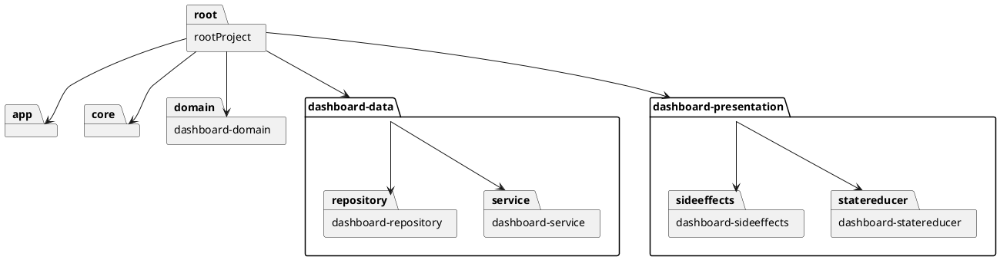
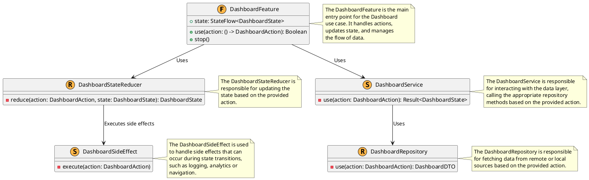
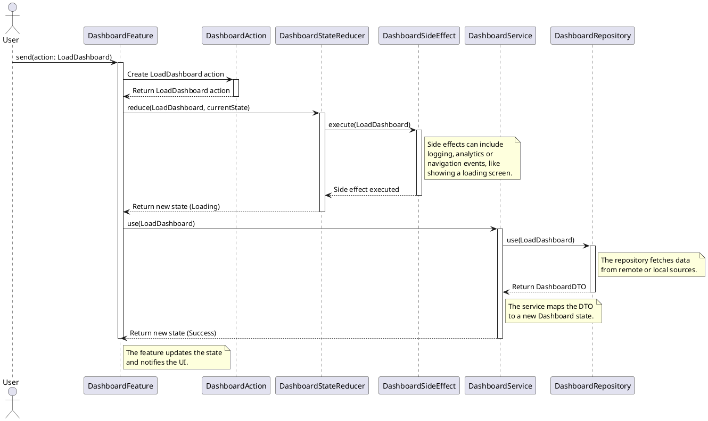

# io.thorib.dashboard

Este proyecto implementa el use case "Dashboard" utilizando la arquitectura propuesta por el framework Thoribio.

## Estructura del Proyecto

La estructura del proyecto se organiza en los siguientes módulos:

Estructura del proyecto

## Diagrama de Clases

El diagrama de clases para el use case "Dashboard" es el siguiente:

Diagrama de clases

## Diagrama de Secuencia

El diagrama de secuencia para el use case "Dashboard" es el siguiente:

Diagrama de secuencia

